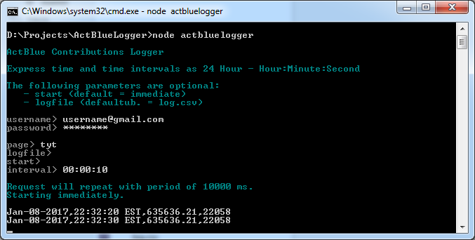

# ActBlueLogger

Accesses ActBlue API to log fundraiser progress over time. Data is written to a specified file in CSV format. Requires standard ActBlue account and **NodeJS** to run.

```
npm install
node actbluelogger
```

### Screenshot


